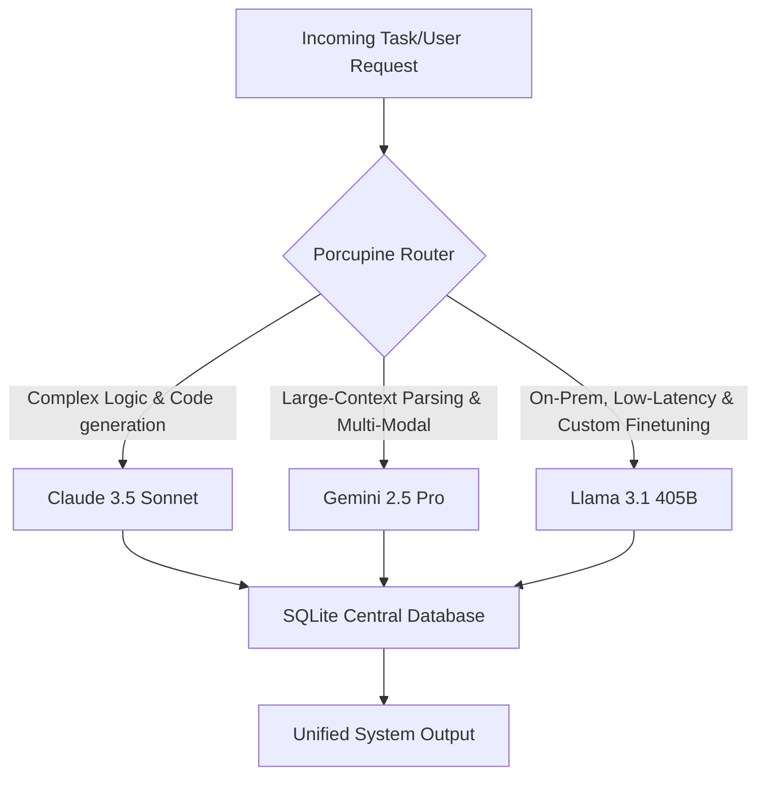
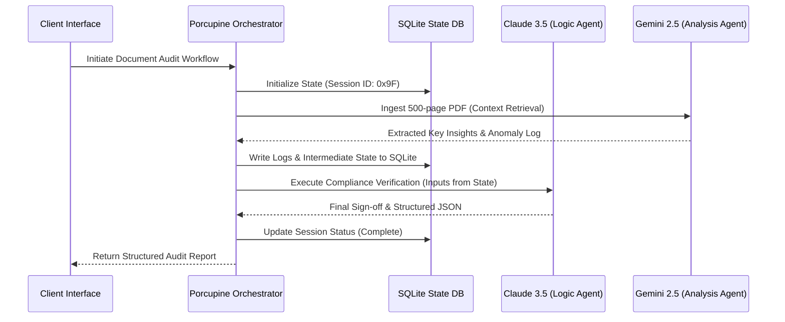

## The Strategic Imperative: Dynamic Multi-Model Orchestration

For enterprise engineering leaders, deploying a single LLM across an entire operational workflow is an architectural anti-pattern. Monolithic model deployment introduces massive cost inefficiencies, scaling bottlenecks, and single-point-of-failure vulnerabilities. High-performing engineering teams are moving toward **dynamic multi-model routing architectures**—assigning specific agents within a workflow to the LLM best suited for their exact computational requirements.

This strategic brief outlines the production roadmap for building an intelligent routing layer. We evaluate **Claude 3.5 Sonnet**, **Gemini 2.5 Pro**, and **Llama 3.1 405B** across enterprise-critical dimensions, demonstrating how a multi-agent framework optimizes both performance and bottom-line spend.

---

## 1. Multi-Model Evaluation Matrix

To build an efficient routing layer, we must first classify our models by their architectural strengths and execution profiles.

### Claude 3.5 Sonnet (Anthropic)
*   **Primary Workload Suitability:** Complex reasoning, structured tool use, and advanced code synthesis.
*   **Context Window Performance:** Highly reliable needle-in-a-haystack retrieval up to 200k tokens, though latency scales non-linearly.
*   **API Latency (TTFT / TPS):** Moderate Time-To-First-Token (TTFT); exceptional output throughput (Tokens-Per-Second).
*   **Enterprise Trade-off:** Premium pricing per million tokens requires strict routing guardrails to avoid runaway costs.

### Gemini 2.5 Pro (Google)
*   **Primary Workload Suitability:** Massive document ingestion, long-context audio/video analysis, and multi-modal grounding.
*   **Context Window Performance:** Industry-leading native 2M+ token window with near-perfect recall.
*   **API Latency (TTFT / TPS):** High latency on initial long-context ingestion, but highly optimized processing for subsequent queries using context caching.
*   **Enterprise Trade-off:** Heavily reliant on Google Cloud infrastructure; potential data sovereignty concerns for highly regulated industries.

### Llama 3.1 405B (Meta / Self-Hosted)
*   **Primary Workload Suitability:** High-security data pipelines, domain-specific fine-tuning, and low-latency hybrid cloud deployments.
*   **Context Window Performance:** Robust 128k context window, optimal for typical enterprise agent interactions.
*   **API Latency (TTFT / TPS):** Highly dependent on hardware allocation. When deployed on dedicated H100 clusters via vLLM or TensorRT-LLM, it delivers unmatched private throughput.
*   **Enterprise Trade-off:** High upfront infrastructure overhead (VRAM footprint) offset by zero marginal variable token costs.

---

## 2. Architectural Blueprint: The State-Synchronized Router

An enterprise agentic system cannot rely on stateless API calls. To maintain reliability, agents must communicate through a shared state. The diagram below illustrates how a centralized state store acts as the single source of truth, eliminating context drift as tasks are routed between different engines.

### Key Architectural Concepts to Cover:
*   **Decoupled State Management:** Keep the agent system stateless by storing execution logs, variables, and history in a centralized, ultra-lightweight SQLite database.
*   **Context Ingestion vs. Execution Cost:** Route initial heavy context parsing to Gemini's context-cached endpoints, while routing logical execution loops to Llama 3 or Claude.
*   **Dynamic Fallbacks:** If Claude hits a rate limit or Google Cloud experiences a regional outage, the orchestrator must hot-swap workloads to a self-hosted Llama 3 instance instantly without losing conversational state.

---

## 3. Positioning ATMA AI's Porcupine Orchestrator

This technical analysis highlights the precise operational challenges we solved when designing the **Porcupine Orchestrator**. 

Rather than forcing enterprises to choose a single model or build complex, custom routing frameworks from scratch, the Porcupine Orchestrator acts as an out-of-the-box, multi-agent router. 

*   **SQLite-Powered State Synchronization:** Our proprietary architecture uses a centralized SQLite database to allow different agents—whether powered by Claude, Gemini, or Llama—to seamlessly pass data to one another with zero state degradation.
*   **Autonomous Cost & Latency Optimization:** Porcupine evaluates every incoming task in real-time, calculating the optimal path based on budget limits, speed requirements, and task complexity.
*   **Operational Impact:** By offloading simple tasks to smaller local models and saving frontier models for high-complexity reasoning, our clients regularly reduce their monthly API costs by up to 40% while maintaining absolute system stability.

---

## 4. SEO Brief & Production Requirements

### Target Audience & Intent
*   **Primary Audience:** CTOs, VPs of Engineering, Enterprise Architects, Directors of Infrastructure.
*   **Search Intent:** Informational/Transactional. The reader is actively researching how to architect a multi-model system or looking for an orchestrator to manage their LLM costs and latency.

### Image Requirements
To maximize engagement and break up deep technical text, the writer must include the following visual assets:
1.  **Section 1 (Below the Evaluation Matrix):** A high-resolution conceptual graphic illustrating the "Token Cost vs. Reasoning Capability" frontier for Claude, Gemini, and Llama.
2.  **Section 2 (Within the Architectural Blueprint):** An inline database schema diagram highlighting how the SQLite centralized state table tracks agent execution steps and variables.

### Verifiable Citation Mandates
To establish industry-grade authority, the writer must integrate and cite:
*   Real-world benchmark data from LMSYS Chatbot Arena or MLCommons regarding execution speeds.
*   Recent market projections from Gartner or Forrester on the adoption of agentic workflows and multi-LLM architectures.
*   Academic citations (e.g., ArXiv papers on LLM routing heuristics or speculative decoding in multi-agent environments).