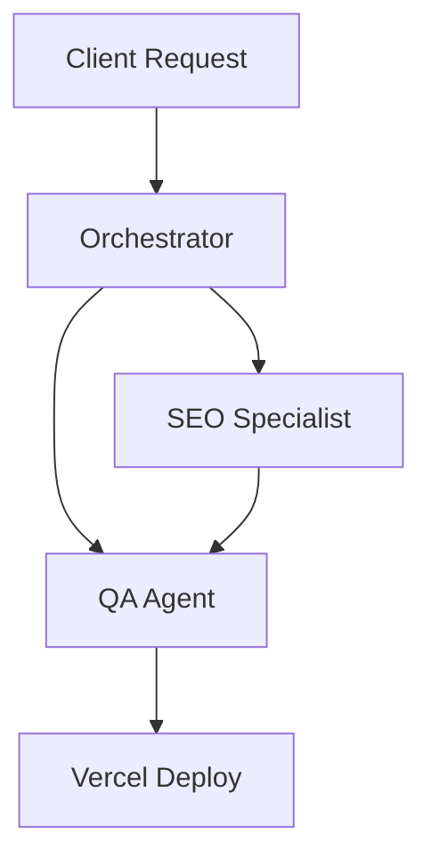

# The Future of Multi-Agent Systems in Enterprise IT

Multi-agent orchestration allows complex enterprise operations to be handled dynamically. 
Unlike static pipelines, autonomous agents can negotiate tasks.

> [!NOTE]
> This is a test post generated by the ATMA AI workflow test script.
